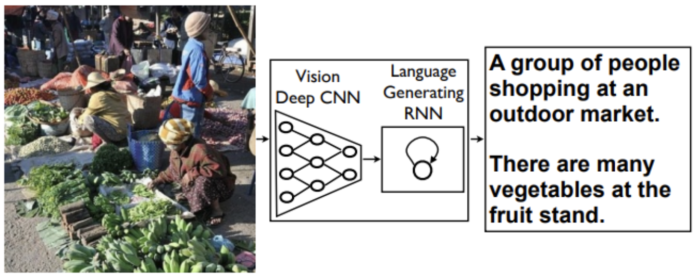

<h1 align="center">
  Image Caption Generator
</h1>

<p align="center">
  
  
  
</p>

This project presents a web-based image captioning application built on the **Neural Image Caption (NIC)** architecture described in the paper [Show and Tell: A Neural Image Caption Generator](https://arxiv.org/abs/1411.4555). The model was trained on the [COCO 2014](https://cocodataset.org/#home) image captioning dataset.

<p align="center">
  
  <br>
  <em>
    Image Caption Generator Architecture
  </em>
</p>

Upload any image and the model generates a natural language description. The full project report is available at [docs/Report.pdf](docs/Report.pdf).

### Authors
- Iván Hernández — [iv97n](https://github.com/iv97n)
- Marcel Fernández — [u198734](https://github.com/u198734)
- Alejandro Pastor — [u199327](https://github.com/u199327)


## Architecture

The model follows an encoder-decoder design:

- **Encoder** — a pretrained CNN (ResNet) extracts a fixed-length feature vector from the input image.
- **Decoder** — an LSTM generates a caption word-by-word conditioned on the image features.


## Setup

### Prerequisites
- [Python Poetry](https://python-poetry.org/docs/) — or Docker

### 1. Clone the repository
```bash
git clone git@github.com:iv97n/image-captioning.git
cd image-captioning
```

### 2. Download the pretrained model
Create a `model/` directory and download the checkpoint into it:
```bash
mkdir model
```
Download [nic.ckpt](https://drive.google.com/file/d/1aDKoQWUp-YmMxA-tRhdd2XKF02YXGrcs/view?usp=drive_link) and place it at `model/nic.ckpt`.

### 3. Install dependencies
```bash
poetry install
```


## Running the app

```bash
poetry run streamlit run main.py
```

Open `http://localhost:8501` in your browser, upload a `.jpg` or `.png` image, and the model will generate a caption.


## Docker

Build and run the app without a local Python setup:

```bash
docker build -t image-captioning .
docker run -p 8501:8501 -v $(pwd)/model:/app/model image-captioning
```

The app will be available at `http://localhost:8501`.